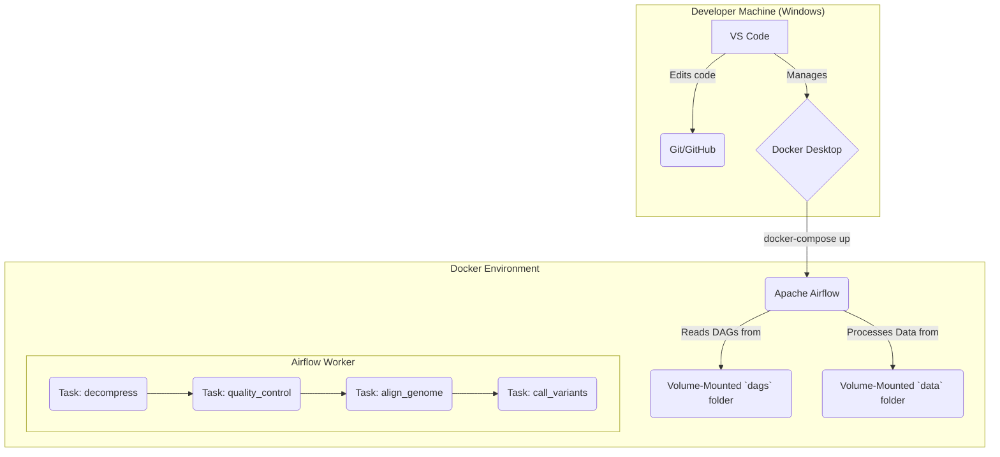

# Project GenomeFlow: v1 Local Simulation Architecture

This document describes the architecture and functionality of the initial 30-hour proof-of-concept version of Project GenomeFlow. This version successfully proved the core logic of a bioinformatics pipeline by running entirely within a local Docker environment.

**This architecture is now considered deprecated and has been superseded by the superior, cloud-native design detailed in the main `README.md` file.**

---

### 1. Project Goal (Original Scope)

The goal of this initial phase was to build an automated, containerized pipeline using **Apache Airflow** and **Docker Compose** on a local machine. The pipeline was designed to process a small, simulated DNA sequencing file through a standard bioinformatics workflow.

### 2. System Architecture (Local Simulation)

The project ran as a self-contained, multi-container application orchestrated by Docker Compose.

### 3. Technology Stack (Local Simulation)

| Technology | Role |
| :--- | :--- |
| **Apache Airflow** | Orchestrated the multi-step workflow on the local machine. |
| **Docker & Docker Compose** | Created the local, containerized test environment. |
| **Python 3.11** | Used to write the Airflow DAGs with the `BashOperator`. |
| **Local Filesystem** | A volume-mounted `./data` folder was used as the single source for all input, intermediate, and output files. |
| **Bioinformatics Tools** | `FastQC`, `BWA`, `Samtools`, and `BCFtools` were installed in the Docker image to perform the analysis. |

### 4. Limitations of this Architecture

While successful as a proof-of-concept, this local simulation had significant limitations that prevent it from being a viable real-world solution:

*   **Lack of Scalability:** The entire pipeline ran on a single machine's resources, making it unsuitable for processing large, real-world datasets or running multiple samples in parallel.
*   **Inefficient Data Handling:** Each task wrote its output back to the main data folder, leading to high I/O and making the pipeline difficult to restart from a point of failure.
*   **Stateful and Fragile:** The system relied on the state of the local filesystem. It was not resilient or designed for a distributed environment.

These limitations were the primary motivation for the architectural pivot to the cloud-native design detailed in the main project `README.md`.
