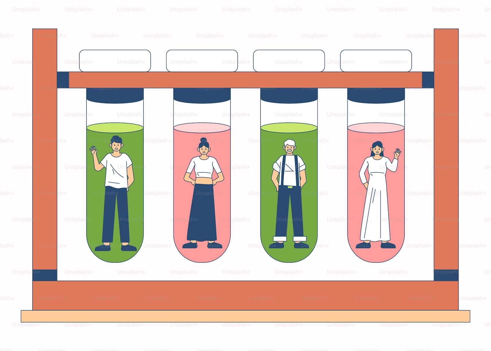
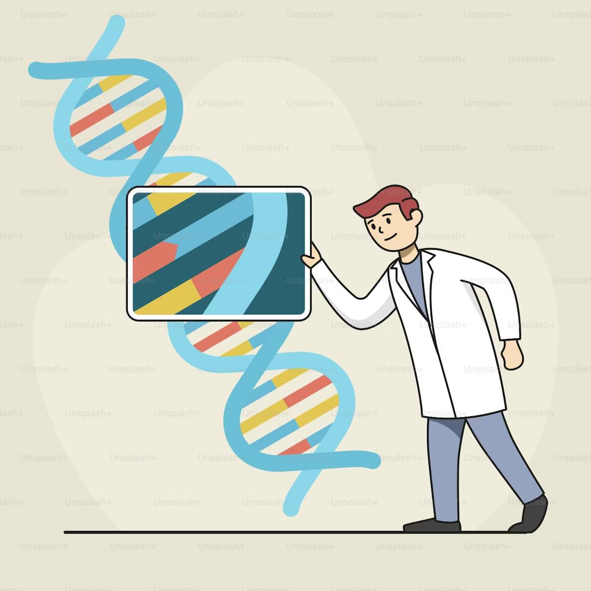
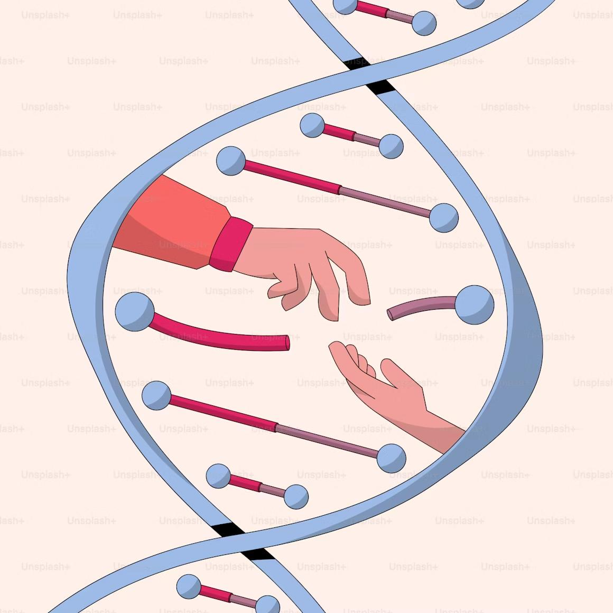
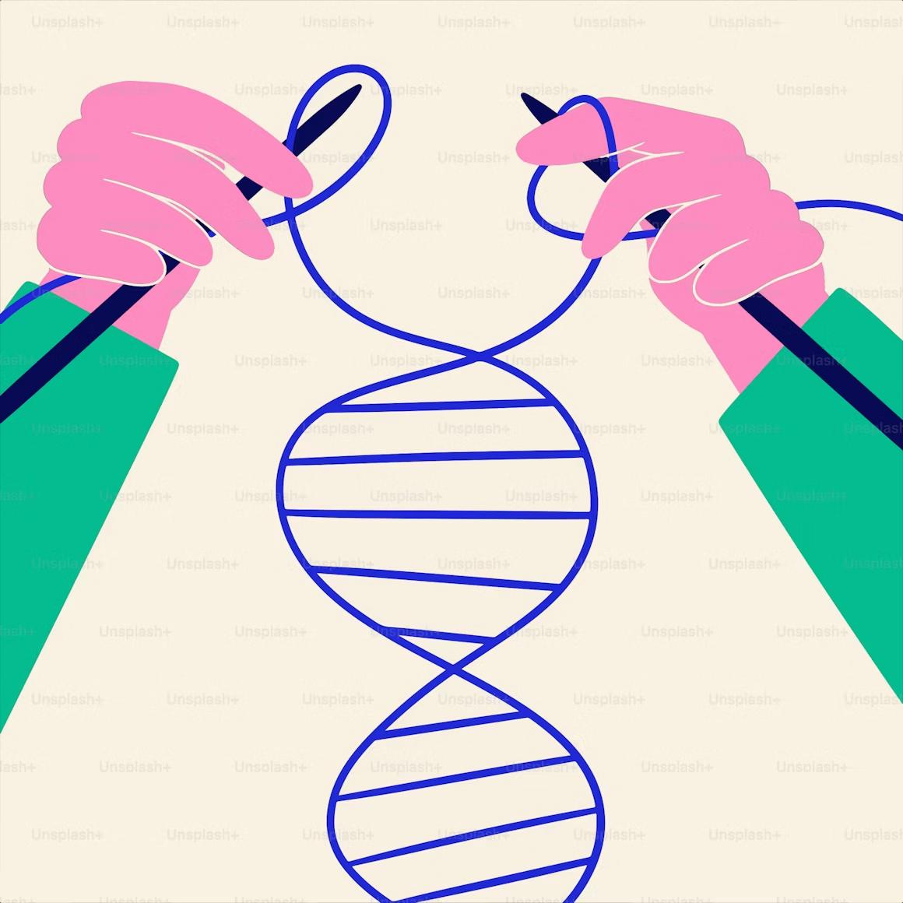

<div align="center">
  <h1>🌋 Geyser Genomics 🌋</h1>
  <p>
    <strong>A fully automated, cloud-native platform on AWS for scalable genomic data analysis.</strong>
  </p>
  
  <p>
    <a href="#"></a>
  </p>

  <p>
    <a href="https://aws.amazon.com/"></a>
    <a href="https://www.terraform.io/"></a>
    <a href="https://github.com/features/actions"></a>
    <a href="https://aws.amazon.com/step-functions/"></a>
    <a href="https://www.docker.com/"></a>
    <a href="https://www.python.org/"></a>
  </p>
</div>

<!-- This is your banner image. It will be centered automatically. -->
<div align="center">
  
</div>

---

### 📋 Table of Contents

1.  [What is Geyser Genomics?](#-what-is-geyser-genomics) 
2.  [The Odyssey: Why This Project Exists](#-the-odyssey-why-this-project-exists)
3.  [The Challenge: From a DNA Sample to an Answer](#-the-challenge-from-a-dna-sample-to-an-answer)
4.  [The Impact: Key Benefits](#-the-impact-key-benefits)
5.  [Project Status & Features](#️-project-status--features)
6.  [How It Works: The Architecture](#️-how-it-works-the-architecture)
7.  [Technical Deep Dive](#-technical-deep-dive)
8.  [Deployment & Usage](#-deployment--usage)

---

## 💡 What is Geyser Genomics?

Geyser Genomics is an **automated, serverless data processing platform**. Its purpose is to execute the complex scientific workflow that transforms raw, unreadable DNA data from a sequencing machine into a final, human-readable list of genetic variants.

It functions as a **robotic science lab in the cloud**. A scientist simply uploads their raw data file, and the platform automatically summons the necessary cloud resources, runs a multi-step bioinformatics analysis, and places the final results in a secure data lake, all with zero manual intervention.

**The Transformation: From Raw Data to Actionable Insight**

| Input | The Platform's Process (Automation) | Output |
| :--- | :--- | :--- |
| 🧬 **Raw Data File** <br> *(Millions of jumbled DNA fragments)* | 1. **Decompress** & **Quality Control**<br> 2. **Align** to a reference genome<br> 3. **Call** genetic variants | 📄 **VCF File** <br> *(A clean list of genetic mutations)* |

The platform provides four key advantages:

*   ⚙️ **Fully Automated:** The entire pipeline is event-driven. An upload to S3 triggers the workflow, eliminating manual setup and human error.
*   🚀 **Infinitely Scalable:** Built on serverless AWS services like Step Functions and Fargate, the platform scales from zero to thousands of parallel jobs on demand, then scales back to zero.
*   💰 **Cost-Effective:** By using serverless resources, you only pay for the exact compute time used. There are no idle servers or clusters to manage.
*   🔬 **Scientifically Rigorous:** Every tool and process is packaged in version-controlled Docker containers and managed by a CI/CD pipeline, ensuring every analysis is 100% reproducible.

## 🧭 The Odyssey: Why This Project Exists

This project was born from a profound, life-changing journey through the world of genomic medicine. It is a tribute to the pioneering work of NHS England and its **100,000 Genomes Project**.

> The NHS 100,000 Genomes Project is a landmark UK initiative aimed at sequencing the complete genetic codes of patients with rare diseases and their families. By creating this massive dataset, it seeks to uncover new diagnoses and pave the way for personalized medicine.

For eighteen years, my life was an odyssey through a fog of medical uncertainty with no linking diagnosis. As part of the project, my mother, my father, and I all donated our blood. Our entire genomes would be sequenced and explored, becoming three more data points in a vast ocean of information. We were told it was unlikely we would hear anything back.

<table align="center" border="0" cellspacing="0" cellpadding="10">
  <tr>
    <td align="center">
      
    </td>
    <td align="center">
      
    </td>
  </tr>
</table>

A year later, against all odds, I received a result. The project had delivered a link. In the three billion letters of my genetic code, they had found a single, ultra-rare mutation in the **COA3 gene**, causing a mitochondrial defect.

<table align="center" border="0" cellspacing="0" cellpadding="10">
  <tr>
    <td align="center">
      
    </td>
    <td align="center">
      
    </td>
  </tr>
</table>

The statistical probability of this discovery is staggering. The odds of both parents carrying the same rare recessive fault and passing it on is approximately **1 in 64 million**.

### The 1 in 64 Million Chance

This isn't a random number; it's grounded in a core concept of population genetics known as the **Hardy-Weinberg principle**. It's the scientific method for estimating how rare a genetic trait is. The principle is expressed with the equation:

$$ p^2 + 2pq + q^2 = 1 $$

This describes how genetic variations are distributed in a population, where `2pq` represents the probability of being a carrier—like my parents. The calculation itself is a straightforward product of these rare probabilities:

*   **🧑 Carrier Frequency:** The estimated chance of one person being a carrier (`2pq`) is **1 in 8,000**.
*   **🧑‍🤝‍🧑 Two Carriers Meet:** The probability of two such carriers meeting is therefore:

<p align="center">
  <code>(1 / 8,000)   ×   (1 / 8,000)   =   1 / 64,000,000</code>
</p>

My donated genome will now serve as a data point to help others, ensuring that a single-letter fault doesn't define another patient's life. My odyssey of discovery took two decades, but it doesn't need to be that way for others. With technologies like Geyser Genomics, we can accelerate these discoveries and build solutions that may one day repair the very code of life itself.

<table align="center" border="0" cellspacing="0" cellpadding="10">
  <tr>
    <td align="center" width="32%">
      
      <br><em>We can help eachother</em>
    </td>
    <td align="center" width="32%">
      
      <br><em>By looking within ourselves</em>
    </td>
    <td align="center" width="32%">
      
      <br><em>To build a better future</em>
    </td>
  </tr>
</table>

---
## 🤔 The Challenge: From a DNA Sample to an Answer

Analyzing genomes is incredibly difficult. Scientists face three major hurdles:

*    **The Data Deluge:** A single human genome can be over 100 gigabytes. Analyzing hundreds requires a staggering amount of storage and power.
*    **The Complex Recipe:** The analysis involves dozens of specialized scientific tools, each needing to be run in a specific order with precise parameters. One mistake can invalidate the results.
*    **The Hardware Hurdle:** This work traditionally requires buying and maintaining powerful, expensive server clusters that are difficult to manage and often sit idle.

## ✨ The Impact: Key Benefits

| Benefit | How Geyser Genomics Delivers |
| :--- | :--- |
| **Blazing Speed** | By using thousands of on-demand cloud CPUs in parallel, analyses that took weeks can now be completed in a matter of hours. |
| **Unwavering Reliability** | The automated workflow and version-controlled containers eliminate human error, producing consistent and trustworthy results every time. |
| **Drastic Cost Reduction** | Built entirely on serverless principles, there are no idle resources. You only pay for computers when they are actively working. |
| **Empowered Scientists** | Researchers can run massive analyses without needing to be cloud experts, freeing them to focus entirely on the science. |

## 🗺️ Project Status & Features

The platform is a feature-complete backend, providing a robust, automated foundation for genomic analysis.

| Feature | Status | Description |
| :--- | :---: | :--- |
| **Infrastructure as Code** | ✅ Complete | The entire AWS environment is deployed and managed by Terraform. |
| **Automated CI/CD** | ✅ Complete | Every `git push` triggers GitHub Actions to build, test, and deploy the platform. |
| **Serverless Orchestration** | ✅ Complete | AWS Step Functions manages the entire scientific workflow, from start to finish. |
| **Scalable Compute Engine** | ✅ Complete | AWS Batch with Fargate provides containerized, on-demand compute resources that scale to zero. |
| **Event-Driven Workflow** | ✅ Complete | The pipeline is automatically triggered by file uploads to the S3 data lake. |
| **Custom Monitoring** | ✅ Complete | The application emits custom metrics to CloudWatch, visualized on a dynamic dashboard. |
| **Web UI Front-End** | 🗓️ Future Work | A Django-based web application to provide a user-friendly interface for the platform. |

## 🛠️ How It Works: The Architecture

This platform is built on a modern, event-driven, serverless architecture. There are no virtual machines or servers to manage.

```mermaid
graph TD
    A[1. User uploads FASTQ file] --> B[Amazon S3 Data Lake];
    B -- S3 Event --> C[AWS Lambda Trigger];
    C -- Starts Execution --> D[AWS Step Functions State Machine];

    subgraph "Bioinformatics Workflow (Orchestrated by Step Functions)"
        D -- "Run Decompress" --> E[AWS Batch Job on Fargate];
        E -- "Reads/Writes Data" --> B;
        E -- "Success" --> F[AWS Batch Job on Fargate];
        F -- "Run Quality Control" --> G[AWS Batch Job on Fargate];
        G -- "Reads/Writes Data" --> B;
        G -- "Success" --> H[AWS Batch Job on Fargate];
        H -- "Run Align" --> I[AWS Batch Job on Fargate];
        I -- "Reads/Writes Data" --> B;
        I -- "Success" --> J[AWS Batch Job on Fargate];
        J -- "Run Call Variants" --> K[Final VCF Result];
        K --> B;
    end
    
    subgraph "CI/CD Pipeline (GitHub Actions)"
        L[git push] --> M{Build, Push & Deploy};
        M --> N[Amazon ECR];
        M --> D;
    end
    
    subgraph "Observability"
        E -- "Emit Custom Metrics" --> O[Amazon CloudWatch];
        G -- "Emit Custom Metrics" --> O;
        I -- "Emit Custom Metrics" --> O;
        J -- "Emit Custom Metrics" --> O;
        O --> P[CloudWatch Dashboard];
    end

    style A fill:#4CAF50,stroke:#333,stroke-width:2px,color:#fff
    style K fill:#9C27B0,stroke:#333,stroke-width:2px,color:#fff


## 🤖 Technical Deep Dive

The platform's design is guided by modern cloud-native principles:

| Technology | Role & Rationale |
| :--- | :--- |
| **Terraform** | **The Cloud Architect.** Defines all AWS resources (VPC, S3, IAM, ECR, Batch) as code. This ensures a consistent, repeatable, and secure deployment every time. |
| **AWS Step Functions** | **The Serverless Conductor.** Replaces the operational burden of self-hosting an orchestrator like Airflow. It translates the scientific pipeline into a resilient, managed state machine, handling state, error handling, and parallelism. |
| **AWS Batch + Fargate** | **The Serverless Compute Engine.** Manages a fleet of on-demand, containerized compute resources. It handles job queuing, scheduling, and scaling from zero to thousands of CPUs, eliminating the need to manage a cluster. |
| **Docker** | **The Reproducible Toolbox.** Packages all bioinformatics tools (`FastQC`, `BWA`, `Samtools`, etc.) and their specific dependencies into a single, portable container image. This guarantees scientific reproducibility. |
| **GitHub Actions**| **The CI/CD Engine.** Automates the entire build and deployment process. A `git push` triggers the workflow to build the Docker image, push it to ECR, and deploy all infrastructure changes with Terraform. |
| **Amazon S3**| **The Data Lake.** Provides durable, scalable, and cost-effective storage for massive genomic datasets. It serves as the event source for the pipeline and the single source of truth for all data. |
| **Python**| The primary language for the bioinformatics application logic (`app/tasks.py`) and for interacting with AWS services via the `boto3` SDK. |
## 🚀 Deployment & Usage

### 1. The Deployment Process (Automated)
This platform is designed for a zero-touch deployment. The entire infrastructure is deployed via the CI/CD pipeline defined in `.github/workflows/deploy-platform.yml`. This workflow is triggered by a `git push` to the `main` branch.

**Prerequisites for CI/CD:**
*   An AWS Account.
*   The following secrets configured in the GitHub repository settings:
    *   `AWS_REGION`: The target AWS region (e.g., `eu-west-2`).
    *   `ECR_IAM_ROLE_ARN`: The ARN of the IAM role for building and pushing to ECR.
    *   `TERRAFORM_IAM_ROLE_ARN`: The ARN of the IAM role for running Terraform.

### 2. How to Use the Platform (Event-Driven)
Once deployed, using the platform is as simple as uploading a file.

1.  **Locate the S3 Data Lake:** Find the S3 bucket created by Terraform. Its name will be in the format `geyser-genomics-data-lake-<random-suffix>`.
2.  **Upload Raw Data:** Upload your gzipped FASTQ file (e.g., `sample.fq.gz`) to the `/inputs` prefix in the S3 bucket.
3.  **Monitor the Execution:** The upload will automatically trigger the Step Functions state machine. You can monitor its progress in the AWS Step Functions console.
4.  **Retrieve Results:** Upon successful completion, the final VCF file will be placed in the `/outputs` prefix of the same S3 bucket.

### 3. Dashboard Management
The custom CloudWatch Dashboard provides real-time performance metrics for the pipeline. Due to the complexity of its JSON definition and the unreliability of managing it via Terraform, this resource is managed by a dedicated Python script.

To deploy or update the dashboard, run the following command from the project root:
```bash
python scripts/deploy_dashboard.py
