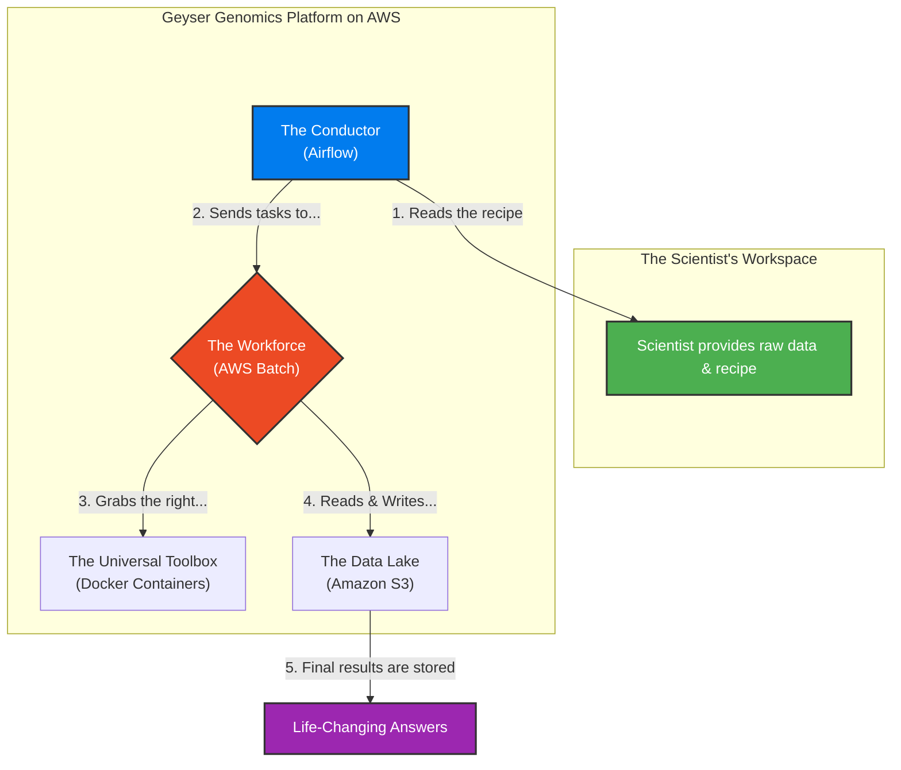

<div align="center">
  <h1>🌋Geyser Genomics🌋</h1>
  <p>
    <strong>An automated, cloud-based platform designed to accelerate the discovery of life-changing genetic insights.</strong>
  </p>
  
  <p>
    <a href="#"></a>
  </p>

  <p>
    <a href="#"></a>
    <a href="#"></a>
    <a href="#"></a>
    <a href="#"></a>
  </p>
</div>

<!-- This is your banner image. It will be centered automatically. -->
<div align="center">
  
</div>

---

### 📋 Table of Contents

1.  [What is Geyser Genomics?](#-what-is-Geyser-genomics) 
2.  [The Odyssey: Why This Project Exists](#-the-odyssey-why-this-project-exists)
3.  [The Challenge: From a DNA Sample to an Answer](#-the-challenge-from-a-dna-sample-to-an-answer)
4.  [The Impact: Key Benefits](#-the-impact-key-benefits)
5.  [Project Status & Features](#️-project-status--features)
6.  [How It Works: A Visual Guide](#️-how-it-works-a-visual-guide)
7.  [For Developers: A Technical Deep Dive](#️-for-developers-a-technical-deep-dive)
    *   [Deployment Guide](#deployment-guide)

---

---

## 💡 What is Geyser Genomics?

Geyser Genomics is an **automated data processing pipeline**. Its specific job is to execute the complex scientific workflow that transforms raw, unreadable DNA data from a sequencing machine into a final, human-readable list of genetic variants (mutations).

It essentially functions as a **robotic science lab in the cloud**. Instead of a scientist manually setting up servers and running dozens of software tools in sequence, this platform automates the entire process from start to finish.

**The Transformation: From Raw Data to Actionable Insight**

| Input | The Platform's Process (Automation) | Output |
| :--- | :--- | :--- |
| 🧬 **Raw Data File** <br> *(Millions of jumbled DNA fragments)* | 1. **Quality Control** on the raw data. <br> 2. **Alignment:** Compares data to a reference genome. <br> 3. **Variant Calling:** Identifies all differences. | 📄 **VCF File** <br> *(A clean list of genetic mutations)* |

The platform provides four key advantages:

*   ⚙️ **Fully Automated:** Scientists can launch complex analyses with a single click, eliminating manual setup and human error.
*   🚀 **Infinitely Scalable:** The platform can summon the power of hundreds of computers to process massive datasets in parallel, then vanish when the work is done.
*   💰 **Cost-Effective:** By using cloud resources on-demand, we only pay for the exact compute time used, drastically reducing the cost compared to owning physical servers.
*   🔬 **Scientifically Rigorous:** Every step is standardized and reproducible, ensuring the results are reliable and trustworthy.

## 🧭 The Odyssey: Why This Project Exists

This project was born from a profound, life-changing journey through the world of genomic medicine. It is a tribute to the pioneering work of NHS England and its **100,000 Genomes Project**.

> The NHS 100,000 Genomes Project is a landmark UK initiative aimed at sequencing the complete genetic codes of patients with rare diseases and their families. By creating this massive dataset, it seeks to uncover new diagnoses and pave the way for personalized medicine.

For eighteen years, my life was an odyssey through a fog of medical uncertainty with no linking diagnosis. As part of the project, my mother, my father, and I all donated our blood. Our entire genomes would be sequenced and explored, becoming three more data points in a vast ocean of information. We were told it was unlikely we would hear anything back.

<table align="center" border="0" cellspacing="0" cellpadding="10">
  <tr>
    <td align="center">
      
    </td>
    <td align="center">
      
    </td>
  </tr>
</table>

A year later, against all odds, I received a result. The project had delivered a link. In the three billion letters of my genetic code, they had found a single, ultra-rare mutation in the **COA3 gene**, causing a mitochondrial defect.

<table align="center" border="0" cellspacing="0" cellpadding="10">
  <tr>
    <td align="center">
      
    </td>
    <td align="center">
      
    </td>
  </tr>
</table>

The statistical probability of this discovery is staggering. The odds of both parents carrying the same rare recessive fault and passing it on is approximately **1 in 64 million**.

### The 1 in 64 Million Chance

This isn't a random number; it's grounded in a core concept of population genetics known as the **Hardy-Weinberg principle**. It's the scientific method for estimating how rare a genetic trait is. The principle is expressed with the equation:

$$ p^2 + 2pq + q^2 = 1 $$

This describes how genetic variations are distributed in a population, where `2pq` represents the probability of being a carrier—like my parents. The calculation itself is a straightforward product of these rare probabilities:

*   **🧑 Carrier Frequency:** The estimated chance of one person being a carrier (`2pq`) is **1 in 8,000**.
*   **🧑‍🤝‍🧑 Two Carriers Meet:** The probability of two such carriers meeting is therefore:

<p align="center">
  <code>(1 / 8,000)   ×   (1 / 8,000)   =   1 / 64,000,000</code>
</p>

My donated genome will now serve as a data point to help others, ensuring that a single-letter fault doesn't define another patient's life. My odyssey of discovery took two decades, but it doesn't need to be that way for others. With technologies like Geyser Genomics, we can accelerate these discoveries and build solutions that may one day repair the very code of life itself.

<table align="center" border="0" cellspacing="0" cellpadding="10">
  <tr>
    <td align="center" width="32%">
      
      <br><em>We can help eachother</em>
    </td>
    <td align="center" width="32%">
      
      <br><em>By looking within ourselves</em>
    </td>
    <td align="center" width="32%">
      
      <br><em>To build a better future</em>
    </td>
  </tr>
</table>

---
## 🤔 The Challenge: From a DNA Sample to an Answer

Analyzing genomes is incredibly difficult. Scientists face three major hurdles:

*    **The Data Deluge:** A single human genome can be over 100 gigabytes. Analyzing hundreds requires a staggering amount of storage and power.
*    **The Complex Recipe:** The analysis involves dozens of specialized scientific tools, each needing to be run in a specific order. One mistake can invalidate the results.
*    **The Hardware Hurdle:** This work traditionally requires buying and maintaining powerful, expensive server clusters that are difficult to manage and often sit idle.

## ✨ The Impact: Key Benefits

| Benefit | How Geyser Genomics Delivers |
| :--- | :--- |
| **Blazing Speed** | By using hundreds of computers in parallel, analyses that took weeks can now be completed in a matter of hours. |
| **Unwavering Reliability** | The automated workflow and standardized toolboxes eliminate human error, producing consistent and trustworthy results every time. |
| **Drastic Cost Reduction** | We only pay for computers when they are actively working. No more paying for expensive, idle hardware. |
| **Empowered Scientists** | Researchers can run massive analyses without needing to be cloud computing experts, freeing them to focus entirely on the science. |

## 🗺️ Project Status & Features

The platform is feature-complete and capable of running a full-scale analysis from raw genetic data to final results.

| Feature | Status | Description |
| :--- | :---: | :--- |
| **Automated Infrastructure** | ✅ Complete | The entire cloud environment can be deployed with a single command. |
| **Core Bioinformatics Pipeline** | ✅ Complete | A full DNA-Seq pipeline (FASTQ to VCF) is implemented and automated. |
| **Scalable Compute Engine** | ✅ Complete | The system automatically scales from zero to thousands of vCPUs as needed. |
| **Data Management** | ✅ Complete | A centralized data lake architecture for organized and secure data storage. |
| **Workflow Orchestration** | ✅ Complete | The scientific workflow is managed end-to-end, with error handling and retries. |
| **Cost & Performance Monitoring** | 🗓️ Future Idea | Integration with cloud monitoring tools to provide detailed cost breakdowns per run. |

## 🛠️ How It Works: A Visual Guide

This diagram shows the automated workflow. A scientist provides the data and the recipe, and the platform handles everything else.


**In simple terms, here is what the platform is doing:**

*   It takes the raw, jumbled DNA data from the sequencer.
*   It uses powerful scientific software to **compare** that data against a healthy human reference genome.
*   It then runs another set of tools to **find every single difference** or potential 'fault'.
*   Its final output is a simple, readable list of those faults, which a doctor or scientist can then analyze to find the one that matters.

  ---

## 🛠️ For Developers: A Technical Deep Dive

This section provides a detailed technical overview of the project's architecture, components, and deployment process for those interested in running or contributing to the platform.

### Core Architecture Philosophy

The platform is designed around modern DevOps and Data Engineering principles:
*   **Infrastructure as Code (IaC):** The entire cloud environment is declarative, version-controlled, and reproducible, managed by Terraform. There is zero manual "click-ops" configuration.
*   **Decoupled Orchestration:** Apache Airflow acts as a pure workflow orchestrator. It manages the logic, dependencies, and retries of the pipeline but does **not** perform the heavy computation itself.
*   **Serverless Compute:** All bioinformatics tasks are executed as containerized jobs on AWS Batch, which provisions and scales the underlying compute resources (using AWS Fargate or EC2 Spot Instances) on demand. This is highly scalable and cost-effective.
*   **Centralized Data Lake:** All data—raw, intermediate, and final results—is stored in a versioned and access-controlled Amazon S3 bucket, serving as the single source of truth.

### Technology Stack & Rationale

| Technology | Role & Rationale |
| :--- | :--- |
| **Terraform** | **The Cloud Architect.** Defines all AWS resources (VPC, S3, IAM, ECR, Batch) as code. This ensures a consistent, repeatable, and secure deployment every time. |
| **AWS Batch** | **The Serverless Compute Engine.** Manages a fleet of on-demand compute resources to run our jobs. It handles job queuing, scheduling, and scaling, eliminating the need to manage a cluster. |
| **Amazon S3** | **The Data Lake.** Provides durable, scalable, and cost-effective storage for massive genomic datasets. Versioning is enabled to prevent accidental data loss. |
| **Amazon ECR**| **The Container Registry.** A private, secure Docker registry to store and version the custom bioinformatics container images used by AWS Batch. |
| **Apache Airflow** | **The Workflow Conductor.** Deployed on ECS/Fargate for a lightweight, serverless setup. It translates the scientific pipeline into a Directed Acyclic Graph (DAG), submitting jobs to AWS Batch in the correct sequence. |
| **Docker** | **The Reproducible Toolbox.** Packages all bioinformatics tools (`FastQC`, `BWA`, `Samtools`, `GATK`, etc.) and their specific dependencies into a single, portable container image. This guarantees scientific reproducibility. |
| **Python** | The language used to write Airflow DAGs and any custom logic for interacting with AWS services via the `boto3` SDK. |

### ⬇️Deployment Guide⬇️

To deploy the entire Geyser Genomics platform to your own AWS account, follow these steps.

**Prerequisites:**
*   An active **AWS Account** with an IAM user and programmatic access keys.
*   [**Terraform CLI**](https://developer.hashicorp.com/terraform/downloads) (v1.0+) installed locally.
*   [**AWS CLI**](https://aws.amazon.com/cli/) installed and configured (`aws configure`).
*   [**Docker Desktop**](https://www.docker.com/products/docker-desktop/) installed and running.

#### Step 1: Clone the Repository
```bash
git clone https://github.com/Harry5haw/genomeflow-cloud-platform.git
cd genomeflow-cloud-platform
```

#### Step 2: Configure Your Deployment
All infrastructure is defined in the `infrastructure/` directory. Create a configuration file to specify your deployment details.
```bash
cd infrastructure

# Create a variables file from the example
cp terraform.tfvars.example terraform.tfvars
```
Now, open `terraform.tfvars` in a text editor and fill in your desired AWS region and a unique name for your project resources.

#### Step 3: Deploy the Infrastructure
Use Terraform to provision all the necessary AWS resources.
```bash
# Initialize Terraform to download necessary providers
terraform init

# Plan the deployment to see what will be created
terraform plan

# Apply the plan to build the infrastructure
terraform apply
```
*Review the plan and type `yes` when prompted. This will take several minutes to complete.*

#### Step 4: Build and Push the Docker Image
*This step builds the container with the bioinformatics tools and pushes it to the ECR repository created by Terraform.*
```bash
# (Instructions for building and pushing the Docker image will be here)
# This will typically involve an AWS ECR login command followed by 'docker build' and 'docker push'.
```

#### Step 5: Access Airflow and Trigger a Run
Once deployed, the Terraform output will provide the URL for your Apache Airflow UI. You can log in, enable the `genomics_pipeline` DAG, and trigger a new run.
```
