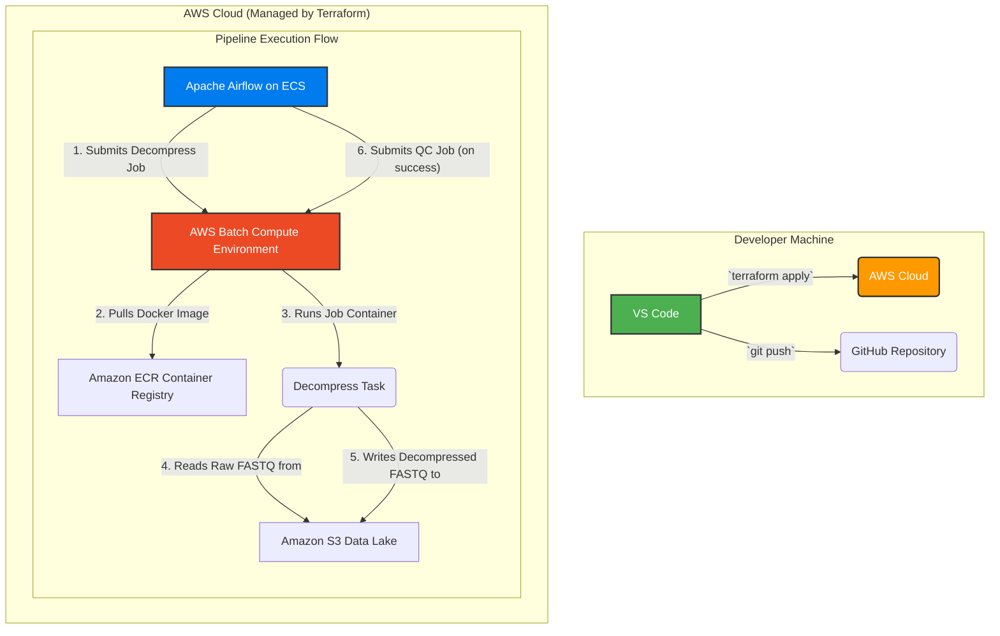

# TerraFlow Genomics: A Cloud-Native Bioinformatics Platform


---

### 1. Introduction: A Personal Motivation

This project is a deeply personal endeavor inspired by my own journey through the world of genomic medicine. I was diagnosed with a rare mitochondrial condition (a COA3 gene mutation) thanks to the UK's 100,000 Genomes Project. That process, which turned raw genetic data into a life-changing diagnosis, seemed like magic. This project is my attempt to build the real-world, scalable infrastructure that makes such magic possible.

**TerraFlow Genomics** is a production-ready, cloud-native bioinformatics pipeline. It uses a modern data engineering and DevOps stack to process raw sequencing data in a way that is scalable, resilient, and cost-effective. The project's name is a portmanteau of its core technologies: **Terra**form and Air**flow**.

For details on the initial proof-of-concept, please see [`README-v1-Local-Simulation.md`](README-v1-Local-Simulation.md). The project's architectural evolution is documented in the [`CHANGELOG.md`](changelog.md).

### 2. Project Goal

The primary goal is to design, build, and deploy a fully automated bioinformatics pipeline on **Amazon Web Services (AWS)**. The entire cloud infrastructure is defined programmatically using **Terraform (Infrastructure as Code)**.

The pipeline is orchestrated by **Apache Airflow**, which submits containerized bioinformatics jobs to **AWS Batch** for scalable, serverless execution. This architecture is designed to mirror the best practices of modern, high-performance scientific computing platforms.

### 3. System Architecture (Cloud-Native)

The architecture is fully decoupled and cloud-native. Airflow acts as a pure orchestrator, while the heavy computational work is delegated to a scalable, serverless batch processing service. All data resides in a central S3 data lake.



### 4. Technology Stack

| Technology | Role |
| :--- | :--- |
| **Terraform** | **The Architect's Blueprint.** Defines all cloud resources—S3, ECR, IAM, and AWS Batch—as version-controlled code. |
| **AWS Batch** | **The Serverless Engine.** Manages a fleet of on-demand compute resources (using Fargate) to run our containerized bioinformatics jobs without managing servers. |
| **Amazon S3** | **The Data Lake.** The central, durable, and scalable storage for all raw data, intermediate files, and final results. |
| **Amazon ECR**| **The Container Registry.** A private, secure repository for storing our custom Docker image. |
| **Apache Airflow** | **The Conductor.** A lightweight orchestrator that defines the pipeline's workflow and submits jobs to AWS Batch in the correct sequence. |
| **Docker** | **The Toolbox.** Packages all bioinformatics tools (`FastQC`, `BWA`, `Samtools`, `BCFtools`) and Python code into a standardized, portable container image. |
| **Python & Boto3** | Used within Airflow for lightweight tasks and to interact with AWS services, and for potential future refactoring of job logic. |


### 5. How to Run This Project

To deploy this entire cloud platform to your own AWS account, follow these steps:

**Prerequisites:**
*   An AWS account with an IAM user and access keys configured.
*   [Terraform](https://developer.hashicorp.com/terraform/downloads) installed locally.
*   [AWS CLI](https://aws.amazon.com/cli/) installed and configured (`aws configure`).
*   [Docker Desktop](https://www.docker.com/products/docker-desktop/) installed and running.

**Instructions:**
1.  **Clone the repository:**
    ```bash
    git clone https://github.com/Harry5haw/genomeflow-cloud-platform.git
    cd genomeflow-cloud-platform
    ```

2.  **Deploy the Infrastructure:**
    Navigate to the infrastructure directory and use Terraform to build the AWS environment.
    ```bash
    cd infrastructure
    terraform init
    terraform apply
    ```
    *This will provision the S3 bucket, ECR repository, and AWS Batch compute environment.*

3.  **(Future Step) Build and Push the Docker Image:**
    *Instructions will be added here to build the custom Docker image and push it to the newly created ECR repository.*

4.  **(Future Step) Deploy and Trigger Airflow:**
    *Instructions will be added here to deploy Airflow to ECS and trigger the final pipeline.*

### 6. Project Status
This project is currently under active development as part of a Final Year Project. The foundational infrastructure (S3, ECR) is complete, and the pipeline logic is being migrated from a local simulation to the cloud-native architecture.
